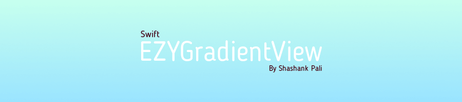

`EZYGradientView` is a different and unique take on creating gradients and gradients with blur on the iOS platform. The default `CAGradientLayer` implementation works just fine, but is confusing and gives different results than expected. From the documentation:

> The start point corresponds to the first stop of the gradient. The point is defined in the unit coordinate space and is then mapped to the layer’s bounds rectangle when drawn. 

It's not really clear what the mapped values for the start and end points will be. If we set the start x coordinate 0.2, it does not resolve to 0.2 of the view's width on the X-axis.

This library attempts to create gradients intuitively. When you use `EZYGradientView`, you don't need to worry about Apple's default API. What you do need to concern yourself with is:

* What your colors are
* The angle of the gradient
* The ratio in which the two colors are distributed; and finally...
* The intensity with which the colors are dispersed

`EZYGradientView` exposes five properties you can modify to customize your gradient. The view itself is `IBDesignable` and its properties `IBInspectable` which means you can customize your gradient in real time on an xib or storyboard.

# Pod Installation 

CocoaPods is the preferred way to install this library. Add this command to your `Podfile`:

```
pod 'EZYGradientView', :git => 'https://github.com/Niphery/EZYGradientView'
```


###For [Objective C](https://github.com/shashankpali/EZYGradientView-ObjC)


# Direct Installation

Download .zip file and extract it. There you will find the `EZYGradientView` folder, copy EZYGradientView.swift to your respective project.

# Integration Methods

## Storyboard/Xib

Just follow these simple steps and create a gradient inside your xib or storyboard!


### Initial Step (Use this step if downloaded by pod)

###### while assigning EZYGradientView to UIView on StoryBoard/Xib don't forget to select module 

|             Step              |                   Description                     |
|-------------------------------|---------------------------------------------------|
| 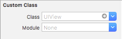 |                                                   |
| 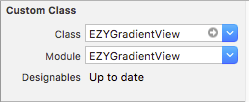 | It will reflect warning if module is not selected.|

### Step 1 - Select colors

|             Step              |  Description  |
|-------------------------------|---------------|
| 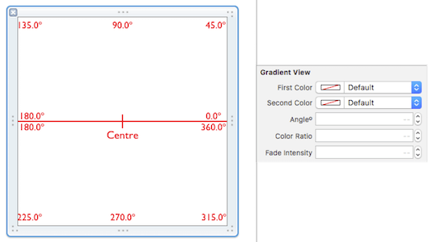 |               |
| 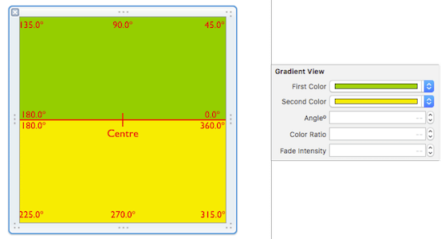 |               |

### Step 2 - Set gradient angle

|             Step              |   Description  |
|-------------------------------|----------------|
| 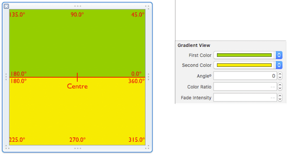 | Default is 0º. |
| 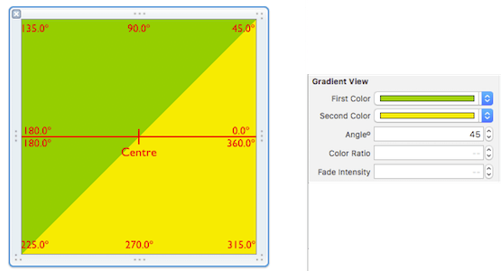 | At 45º.        |
| 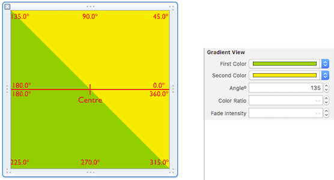 | At 135º.       |

### Step 3 - Set color ratio

|             Step              |                                        Description                                            |
|-------------------------------|-----------------------------------------------------------------------------------------------|
| 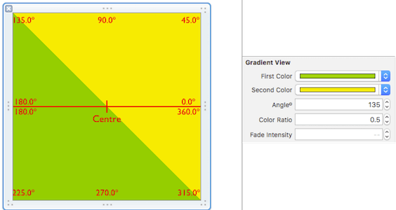 | Default is 0.5, that's why colors are equally divided. Valid range 0 to 1.                    |
| 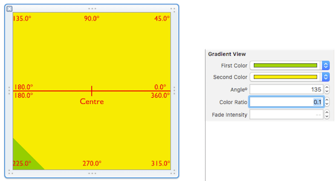 | At 0.1, the first color takes one-tenth of the view area. The rest is filled by the second.   |
| 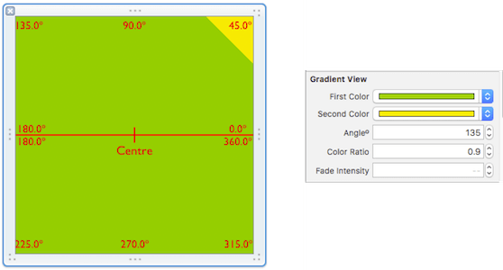 | At 0.9, the first color takes nine-tenths of the view area. The rest is filled by the second. |

### Step 4 - Set fade intensity

|             Step              |                                        Description                                                |
|-------------------------------|---------------------------------------------------------------------------------------------------|
| 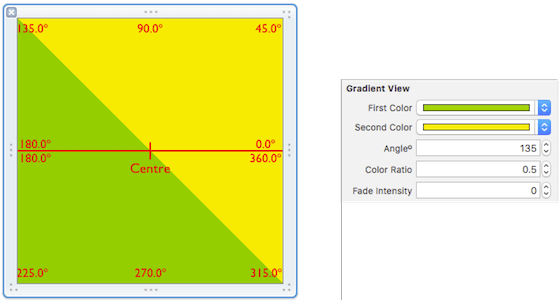 | Default is 0, that's why there is a sharp boundary where the two colors meet. Valid range 0 to 1. |
| 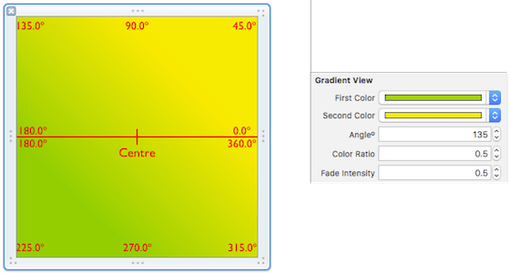 | At 0.5, there is a much smoother transition between the two colors.                               |
| 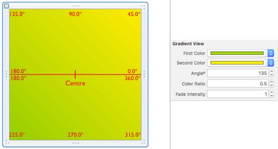 | At 1, the maximum transition smoothness is achieved.                                              |

### Step 5 - Set isBlur and blur opacity 
######(This feature is available for ios 8 and above)
 

|             Step              |                                        Description                                                |
|-------------------------------|---------------------------------------------------------------------------------------------------|
| 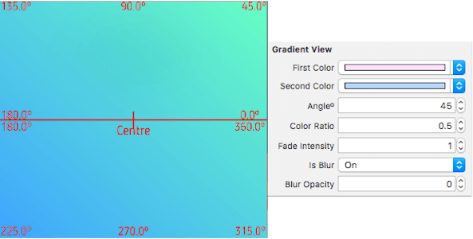 | Default is 0, where the blur transparency is minimmum. Valid range 0 to 1.                        |
| 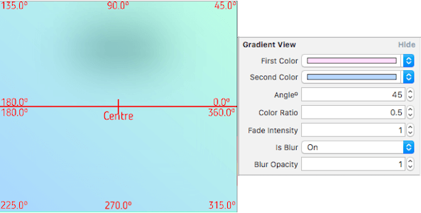 | At 1.0, where the blur transparency is maximum.(The black spot is a label behind gradient view)   |                                       
|          Suggestion           | Use this properties to design `navigationBar`, `tabBar`, `tableHeaderView` etc.                   |

## Programmatic way

```swift
let gradientView = EZYGradientView()
    gradientView.frame = view.bounds
    gradientView.firstColor = UIColor(red: 0.5, green: 0.0, blue: 1.0, alpha: 1.0)
    gradientView.secondColor = UIColor(red: 0.4, green: 1.0, blue: 0.8, alpha: 1.0)
    gradientView.angleº = 185.0
    gradientView.colorRatio = 0.5
    gradientView.fadeIntensity = 1
    gradientView.isBlur = true
    gradientView.blurOpacity = 0.5
    
    view.insertSubview(gradientView, at: 0)
```

# To-do

* Allow more than two colors to create gradients.
* It may crash if blur properties used in lower version than ios 8.
* Use CoreGraphics blur to replace `UIVisualEffectView`.

# Thanks

* To [Sudeep Jaiswal](https://github.com/sudeepjaiswal) for motivating and special thanks for the documentation and ideas.

# License

`EZYGradientView` is available under the MIT license. See the LICENSE file for more info.
